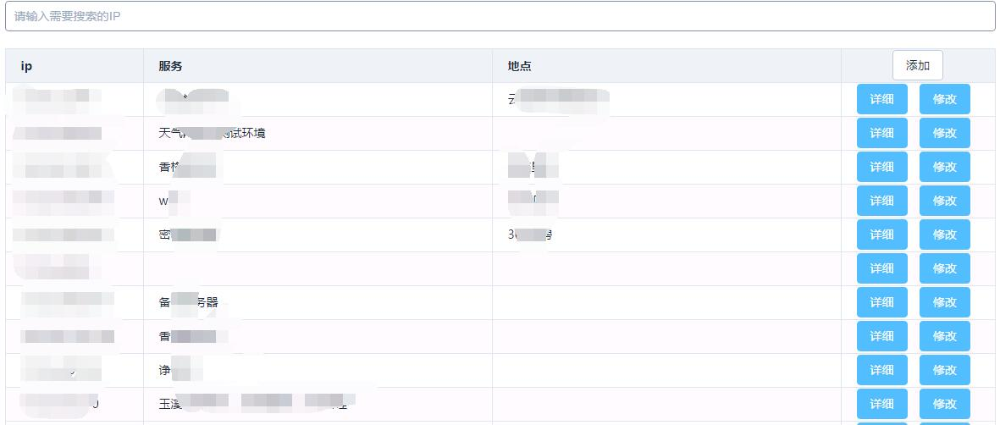

# 基于Vue的密码管理系统

前端基于vue全家桶

UI使用[elementui](https://github.com/ElemeFE/element)

后端使用接口使用[flight](https://github.com/mikecao/flight)和[Medoo](https://github.com/catfan/Medoo)

界面：

## 特色

没有使用传统的用户名/密码的方案，查看和修改的时候需要填写GoogleAuthenticator生成的密码

前后端通信使用https双向验证，关于开启双向验证可以查看[nginx配置ssl双向验证](https://1em0n.com/blog/2016-08-30.html)

还有一个简单的分组管理功能，是基于ip的